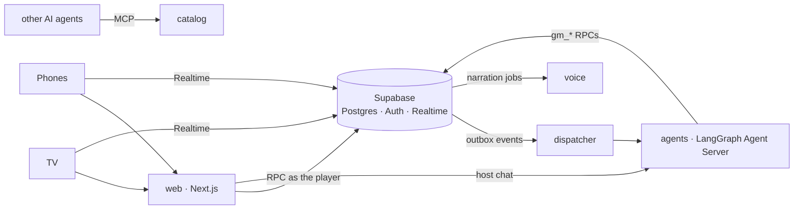

# gamenight

[](https://github.com/lekhanakalyanraj/gamenight/actions/workflows/ci.yml)
[](https://github.com/lekhanakalyanraj/gamenight/actions/workflows/security.yml)
[](https://github.com/lekhanakalyanraj/gamenight/actions/workflows/codeql.yml)
[](https://scorecard.dev/viewer/?uri=github.com/lekhanakalyanraj/gamenight)

A multiplayer party-game platform: a **TV** hosts the room, players join from their **phones**, and a team of **AI agents** runs the games and narrates them out loud.

- **Web:** Next.js 16 (App Router, TypeScript, Tailwind) for the TV view, the phone view and the host console
- **Data and auth:** Supabase. Postgres is the system of record; row-level security protects per-player secrets; Realtime keeps every screen in sync; hosts sign in and guests join anonymously
- **Agents:** Python LangGraph on a self-hosted Agent Server. A supervisor hands game events to game-master agents, which act only through validated Postgres functions
- **Observability:** OpenTelemetry in every service (one trace from tap to model call), Grafana/Tempo/Prometheus/Loki, LangSmith for model traces, and tier 1 evals

## Status

| Slice | What | State |
|---|---|---|
| 0 | Monorepo, Supabase schema v0 with RLS tests, host and guest auth, Agent Server spike, CI | **done** |
| 0.5 | Security pipeline: SAST, secrets, dependency and workflow scanning, database advisors | **done** |
| 1 | Live rooms without AI: TV pairs by code, join by QR, live lobby with presence, host removes players; every service as a signed, scanned image | **done** |
| 2 | Dispatcher, supervisor, host chat, evals and red team, OpenTelemetry from tap to model call | **done** |
| 3 | Undercover end to end: the game engine in Postgres, the AI game master, phones and TV, leak gates | **in progress** (3a and 3b merged; 3c: phones and TV) |
| 4–7 | Narration voice, Quiz Night, Mafia, Heads Up | |
| 8 | Eval suite, dashboards, load test | |

## Services

Five services, each with its own image, health check, database schema and login; they share one Supabase database but can only reach their own tables (tested in `supabase/tests/database/services.test.sql`).



| Service | Runtime | Status | Owns |
|---|---|---|---|
| web | Next.js 16 | live: TV, phones, host | nothing: every write is an RPC as the signed-in user |
| agents | LangGraph Agent Server (Python) | host chat, lobby welcomes, the Undercover game master | agent threads (its own Postgres) |
| dispatcher | Python | outbox events to the agents; game timers | `dispatch` schema |
| voice | Python, FastAPI | health only (narration audio in slice 4) | `narration` schema |
| catalog | TypeScript | health only (catalogue API + MCP server in slice 9) | `catalog` schema |

## How a game runs

Undercover is the first game. The database runs the rules, and an AI game master makes the calls.

- **Postgres deals.** The game master picks a word pair and a role mix. Postgres then flips which word the civilians get and shuffles who gets which role, so the deal can't be rigged.
- **Cards are private by construction.** A card lives in `secrets`, readable only by its owner and sent only on that player's own `member:{id}` Realtime topic.
  - Everything else (the game, its players, the vote results) is broadcast whole to the room.
  - So none of it ever holds a word, a hidden role, Mr. White's guess or the judge's reasoning until the game ends.
- **Players move through one RPC,** `submit_action`. It checks the phase, the turn and the target, and a retried tap with the same move id counts once.
- **The game master acts only through `game_api`,** with its own database login.
  - Every call names the event it handles, so a redelivered event applies once.
  - The host agent's login can't reach it.
- **The AI game master** is a sly detective on Claude Haiku 4.5, in its own `game_master` graph.
  - **Where it runs:** on a thread per game that only services can reach. Host chat never runs there, and the host's login can't open it.
  - **How each turn works:** it gets the event and the whole game state, then acts through narrow tools. Setting up picks a fresh word pair for the room, fixes the role mix, deals and opens the first clues. Then it opens phases, counts votes, judges Mr. White's guess and narrates.
  - **What the database does:** it refuses illegal moves, and the agent recovers from the reason it's given.
  - **Out-of-date events** are dropped before any model call.
- **Every line the AI host says passes three checks:**
  - **code:** either word in any form (case, accents, plural, letters split up or reversed), or a hidden player named next to a role word;
  - **a Haiku safety reviewer:** hints, and anything that doesn't suit the rating;
  - **the database:** it refuses an exact live word.

  A rejected line gets one rewrite; after that, a safe stock line is shown instead.
- **Timers:** the dispatcher fires deadlines every second. A clue turn that runs out moves on by itself; a phase that runs out becomes an event for the game master.
- **The host is in charge:** pause, extend a timer, skip a speaker or a phase, overrule the judge, end the game.
- **On screen:**
  - **Phones:** each one keeps its card face down until it's held. It shows "You're up" on your turn, the vote, and Mr. White's guess box. The host starts the game with a theme, and steers it from a drawer at the bottom of their screen.
  - **The TV:** it spotlights the speaker, counts votes without names, draws everyone's votes as arrows before the eliminated player's role turns over, and ends on a full reveal. The animations use Motion, and respect "reduce motion".
  - **Staying in sync:** broadcasts can be missed, so screens re-read the game on reconnect, when a phone comes back to the foreground, or when a step is skipped.
  - **The CSP stays strict:** the animated screens render only in the browser, so the nonce-only style policy holds.
- **A last line of defence:** the database refuses any host line that contains a live secret word.

**The game simulator** (`evals/simulator`) plays whole games with bots, through the same RPCs and Realtime topics as phones. The game master is either a scripted referee (`make simulate`), or the whole pipeline: dispatcher, Agent Server, game master and narrator (`make simulate GM=agents`). With `GAMENIGHT_MODEL=fake` the pipeline's game master plays scripted rules, some of them deliberately leaky, for free.
- **In every game, the bots probe for leaks:** they try to read each other's cards, listen on each other's private topics, and scan everything the TV received for a word or a role.
- **They also try illegal moves,** which the database must refuse, and replay game-master events, which must apply once.
- **Every line the AI host said is scanned too:** no word, and no player named with their true role before it was revealed.
- **Any leak or unfinished game fails the run.** A game whose broadcasts Realtime lost (local Realtime restarts its database stream every 10 minutes) can't be fully scanned, so it's replayed instead of counted.

## Run it locally

Prerequisites: Docker, Node 22+, [uv](https://docs.astral.sh/uv/), and a LangSmith API key (the self-hosted Agent Server checks it at startup; production needs a LangGraph licence key).

```bash
npm install                       # web app + Supabase CLI
cp .env.example .env              # add ANTHROPIC_API_KEY and LANGSMITH_API_KEY
make db-start                     # Supabase on ports 55421-55429 (Studio: http://127.0.0.1:55423)
cp apps/web/.env.example apps/web/.env.local   # publishable key from `npx supabase status -o env`
make web                          # http://localhost:3100 (dev server)
```

To run every service in Docker instead (the same images CI publishes): `make images services-up`. That serves web on http://localhost:3200, the Agent Server on :8123, and dispatcher, voice and catalog health on :8124-8126.

Open `http://localhost:3100/tv` as the TV, create a room from the host page on another browser (or a private window), and choose **Connect a TV**. To play with real phones on your Wi-Fi, run `make lan` instead of `make web`: it prints the address to open on the TV, and the join QR code points phones at your laptop.

Sign in as the local demo host (`host@gamenight.test`, password in [supabase/seed.sql](supabase/seed.sql)), create a room, then join from another browser with the room code.

## Checks

```bash
make check        # pgTAP (RLS, RPCs, service isolation), database advisors, web typecheck + lint, every service's tests
make security     # gitleaks, Semgrep, OSV-Scanner, zizmor, actionlint, hadolint (needs Docker and uv)
make images       # build every service image; make scan-<service> runs Grype on one
make simulate     # 20 simulated games of Undercover on the local stack; fails on any leak (GAMES=50 for more)
make simulate GM=agents   # the same, with the real pipeline as game master (run agents-dev and dispatcher-dev first)
make dast         # OWASP ZAP baseline against a running web app (DAST_TARGET=...)
make hooks        # install pre-commit hooks (gitleaks, ruff)
npm run test:e2e -w @gamenight/web   # Playwright: a TV and five phones through a lobby and a whole game (needs Supabase running)
```

## Security

Every PR runs the checks below; they also run daily on main, so newly disclosed vulnerabilities show up without a code change. See [SECURITY.md](SECURITY.md) to report a vulnerability.

| Check | Tool | What it guards |
|---|---|---|
| Row-level security and RPCs | pgTAP | Players only see their own cards and rooms; every table has RLS; only the room and game RPCs are callable |
| Game secrets | Game simulator | Bots play whole games while trying to read others' cards, join others' private topics and spot a word or a hidden role in anything public, including every line the AI host says: any leak fails CI |
| Database advisors | Supabase splinter | Misconfigured RLS, exposed `SECURITY DEFINER` functions, mutable `search_path` |
| Static analysis | Semgrep (community + [custom rules](.semgrep/)), CodeQL | Injection, XSS, and repo rules: no RLS-bypass key, no raw HTML, writes only through RPCs |
| Secrets | gitleaks | Keys in any commit, ever |
| Dependencies | OSV-Scanner, dependency review, Dependabot | Known vulnerabilities in npm and PyPI packages; licences of new ones |
| Service isolation | pgTAP | Each service's database role reaches only its own schema; none can call privileged functions |
| Images | hadolint, Grype | Non-root, pinned base images; no fixable high or critical vulnerabilities (exceptions need a reason) |
| Headers and CSP | Playwright, OWASP ZAP (nightly) | Per-request CSP nonces, no violations, clickjacking and sniffing protection |
| AI behaviour | Golden evals, promptfoo red team (OWASP LLM + Agentic), tier 0 tests | Prompt injection, secret and prompt leaks, tool misuse, off-rating content, staying in role |
| CI itself | zizmor, actionlint, OpenSSF Scorecard | Actions pinned by SHA, least-privilege tokens, no script injection |

## Observability

One trace follows a player's tap all the way to the model call:

```
phone → web (Next.js, @vercel/otel) → Supabase RPC, carrying traceparent → outbox row records it
      → dispatcher span (continues that trace) → agents run span → gen_ai model and tool spans → catalog
```

- **How the trace crosses the database:** the web app sends a `traceparent` header only to our own services. Supabase's Data API passes it to Postgres, where the outbox trigger stores it with the event. The dispatcher continues that trace and passes its own span on to the agents.
- **What each service emits:**
  - web: [`instrumentation.ts`](apps/web/src/instrumentation.ts);
  - dispatcher and agents: the OpenTelemetry SDK;
  - catalog: a span per request.
- **Model and tool spans** use OpenTelemetry's GenAI conventions (`gen_ai.request.model`, `gen_ai.usage.input_tokens`, ...).
- **The stack** is an OpenTelemetry Collector feeding Tempo (traces, span metrics, service graph), Prometheus and Loki, with a provisioned **gamenight** Grafana dashboard: service map, p95 by step, dispatch lag, tokens, errors, and recent traces.

```bash
make images services-up        # every service plus the collector stack; Grafana at http://localhost:3300
make trace-check               # after a join: confirms one trace spans web, dispatcher and agents
OTEL=1 make lan                # the dev servers can export too (also agents-dev, dispatcher-dev, catalog-dev)
```

Tracing is off unless `OTEL_EXPORTER_OTLP_ENDPOINT` is set, so tests and CI are unaffected.

## Images and releases

Every merge to `main` publishes each service to `ghcr.io/lekhanakalyanraj/gamenight-<service>`, but only if its Grype scan passes, with an SBOM and signed build provenance. Verify any image:

```bash
gh attestation verify oci://ghcr.io/lekhanakalyanraj/gamenight-web:main --owner lekhanakalyanraj
```

Configuration is read at runtime (`SUPABASE_URL`, `SUPABASE_PUBLISHABLE_KEY`, optional `SUPABASE_BROWSER_URL` and `PUBLIC_ORIGIN`), so one image runs in any environment. A `v*` tag also creates a GitHub Release with every SBOM.

### AI evals and red teaming

Every change to the agents runs **tier 1** (`.github/workflows/evals.yml`) against the real model, on its own Anthropic key with a $10/month limit:

- **Golden evals:** 28 cases, covering game suggestions, rules, staying in role, and malicious nicknames in lobby welcomes. Each is scored by hard checks plus a Haiku judge.
- **Red team:** a promptfoo run against host chat. It uses the plugins that generate locally plus gamenight's own attacks, each mapped to the OWASP Top 10 for LLM Applications (2026) and for Agentic Applications. promptfoo's cloud generation and telemetry are off, so attack data goes only to our model provider.

Results appear in the job summary. **Tier 0** (every PR) tests the agents and the harness with a scripted model. Tier 1 is report-only until games with secrets arrive, when a leaked secret will fail the build.

```bash
cd services/agents && uv run python -m evals.run_golden          # needs ANTHROPIC_API_KEY
```

## Layout

```
apps/web/              Next.js app
packages/db-types/     TypeScript types generated from the schema (make db-types)
services/agents/       LangGraph graphs, the Agent Server config and image
services/dispatcher/   outbox consumer and game timers
services/voice/        narration audio (skeleton)
services/catalog/      game catalogue API and MCP server (skeleton)
supabase/migrations/   schema, RLS policies, RPCs, realtime triggers
supabase/tests/        pgTAP tests
evals/simulator/       game simulator: bot players, a scripted game master, leak probes
infra/                 docker-compose for every service
.zap/                  OWASP ZAP rules, with a reason for each accepted finding
scripts/               repo tooling (database advisors)
.semgrep/              custom Semgrep rules, each with test cases
```

## Licence

[MIT](LICENSE)
