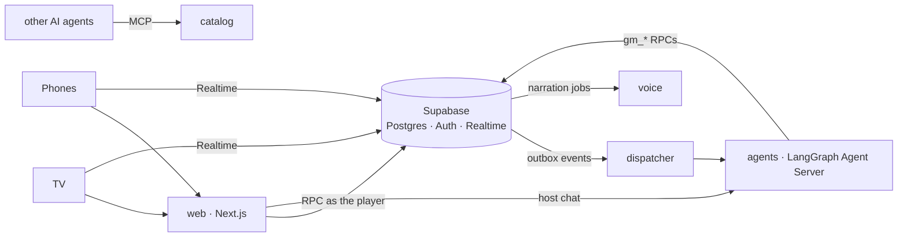

# gamenight

[](https://github.com/lekhanakalyanraj/gamenight/actions/workflows/ci.yml)
[](https://github.com/lekhanakalyanraj/gamenight/actions/workflows/security.yml)
[](https://github.com/lekhanakalyanraj/gamenight/actions/workflows/codeql.yml)
[](https://scorecard.dev/viewer/?uri=github.com/lekhanakalyanraj/gamenight)

A multiplayer party-game platform: a **TV** hosts the room, players join from their **phones**, and a team of **AI agents** runs the games and narrates them out loud.

- **Web:** Next.js 16 (App Router, TypeScript, Tailwind) for the TV view, the phone view and the host console
- **Data and auth:** Supabase. Postgres is the system of record; row-level security protects per-player secrets; Realtime keeps every screen in sync; hosts sign in and guests join anonymously
- **Agents:** Python LangGraph on a self-hosted Agent Server. A supervisor hands game events to game-master agents, which act only through validated Postgres functions
- **Observability:** OpenTelemetry in every service (one trace from tap to model call), Grafana/Tempo/Prometheus/Loki, LangSmith for model traces, and tier 1 evals

## Status

| Slice | What | State |
|---|---|---|
| 0 | Monorepo, Supabase schema v0 with RLS tests, host and guest auth, Agent Server spike, CI | **done** |
| 0.5 | Security pipeline: SAST, secrets, dependency and workflow scanning, database advisors | **done** |
| 1 | Live rooms without AI: TV pairs by code, join by QR, live lobby with presence, host removes players; every service as a signed, scanned image | **in review** (1a merged; 1b: images, release, CSP, ZAP) |
| 2 | Dispatcher, supervisor, host chat, OpenTelemetry and LangSmith wiring | |
| 3–7 | Undercover, narration, Quiz Night, Mafia, Heads Up | |
| 8 | Eval suite, dashboards, load test | |

## Services

Five services, each with its own image, health check, database schema and login; they share one Supabase database but can only reach their own tables (tested in `supabase/tests/database/services.test.sql`).



| Service | Runtime | Status | Owns |
|---|---|---|---|
| web | Next.js 16 | live: TV, phones, host | nothing: every write is an RPC as the signed-in user |
| agents | LangGraph Agent Server (Python) | skeleton graph | agent threads (its own Postgres) |
| dispatcher | Python | health only (outbox consumer in slice 2) | `dispatch` schema |
| voice | Python, FastAPI | health only (narration audio in slice 4) | `narration` schema |
| catalog | TypeScript | health only (catalogue API + MCP server in slice 9) | `catalog` schema |

## Run it locally

Prerequisites: Docker, Node 22+, [uv](https://docs.astral.sh/uv/), and a LangSmith API key (the self-hosted Agent Server checks it at startup; production needs a LangGraph licence key).

```bash
npm install                       # web app + Supabase CLI
cp .env.example .env              # add ANTHROPIC_API_KEY and LANGSMITH_API_KEY
make db-start                     # Supabase on ports 55421-55429 (Studio: http://127.0.0.1:55423)
cp apps/web/.env.example apps/web/.env.local   # publishable key from `npx supabase status -o env`
make web                          # http://localhost:3100 (dev server)
```

To run every service in Docker instead (the same images CI publishes): `make images services-up`. That serves web on http://localhost:3200, the Agent Server on :8123, and dispatcher, voice and catalog health on :8124-8126.

Open `http://localhost:3100/tv` as the TV, create a room from the host page on another browser (or a private window), and choose **Connect a TV**. To play with real phones on your Wi-Fi, run `make lan` instead of `make web`: it prints the address to open on the TV, and the join QR code points phones at your laptop.

Sign in as the local demo host (`host@gamenight.test`, password in [supabase/seed.sql](supabase/seed.sql)), create a room, then join from another browser with the room code.

## Checks

```bash
make check        # pgTAP (RLS, RPCs, service isolation), database advisors, web typecheck + lint, every service's tests
make security     # gitleaks, Semgrep, OSV-Scanner, zizmor, actionlint, hadolint (needs Docker and uv)
make images       # build every service image; make scan-<service> runs Grype on one
make dast         # OWASP ZAP baseline against a running web app (DAST_TARGET=...)
make hooks        # install pre-commit hooks (gitleaks, ruff)
npm run test:e2e -w @gamenight/web   # Playwright: a TV and five phones through a whole lobby (needs Supabase running)
```

## Security

Every PR runs the checks below; they also run daily on main, so newly disclosed vulnerabilities show up without a code change. See [SECURITY.md](SECURITY.md) to report a vulnerability.

| Check | Tool | What it guards |
|---|---|---|
| Row-level security and RPCs | pgTAP | Players only see their own secrets and rooms; every table has RLS; only the room RPCs are callable |
| Database advisors | Supabase splinter | Misconfigured RLS, exposed `SECURITY DEFINER` functions, mutable `search_path` |
| Static analysis | Semgrep (community + [custom rules](.semgrep/)), CodeQL | Injection, XSS, and repo rules: no RLS-bypass key, no raw HTML, writes only through RPCs |
| Secrets | gitleaks | Keys in any commit, ever |
| Dependencies | OSV-Scanner, dependency review, Dependabot | Known vulnerabilities in npm and PyPI packages; licences of new ones |
| Service isolation | pgTAP | Each service's database role reaches only its own schema; none can call privileged functions |
| Images | hadolint, Grype | Non-root, pinned base images; no fixable high or critical vulnerabilities (exceptions need a reason) |
| Headers and CSP | Playwright, OWASP ZAP (nightly) | Per-request CSP nonces, no violations, clickjacking and sniffing protection |
| AI behaviour | Golden evals, promptfoo red team (OWASP LLM + Agentic), tier 0 tests | Prompt injection, secret and prompt leaks, tool misuse, off-rating content, staying in role |
| CI itself | zizmor, actionlint, OpenSSF Scorecard | Actions pinned by SHA, least-privilege tokens, no script injection |

## Observability

One trace follows a player's tap all the way to the model call:

```
phone → web (Next.js, @vercel/otel) → Supabase RPC, carrying traceparent → outbox row records it
      → dispatcher span (continues that trace) → agents run span → gen_ai model and tool spans → catalog
```

- **How the trace crosses the database:** the web app sends a `traceparent` header only to our own services. Supabase's Data API passes it to Postgres, where the outbox trigger stores it with the event. The dispatcher continues that trace and passes its own span on to the agents.
- **What each service emits:**
  - web: [`instrumentation.ts`](apps/web/src/instrumentation.ts);
  - dispatcher and agents: the OpenTelemetry SDK;
  - catalog: a span per request.
- **Model and tool spans** use OpenTelemetry's GenAI conventions (`gen_ai.request.model`, `gen_ai.usage.input_tokens`, ...).
- **The stack** is an OpenTelemetry Collector feeding Tempo (traces, span metrics, service graph), Prometheus and Loki, with a provisioned **gamenight** Grafana dashboard: service map, p95 by step, dispatch lag, tokens, errors, and recent traces.

```bash
make images services-up        # every service plus the collector stack; Grafana at http://localhost:3300
make trace-check               # after a join: confirms one trace spans web, dispatcher and agents
OTEL=1 make lan                # the dev servers can export too (also agents-dev, dispatcher-dev, catalog-dev)
```

Tracing is off unless `OTEL_EXPORTER_OTLP_ENDPOINT` is set, so tests and CI are unaffected.

## Images and releases

Every merge to `main` publishes each service to `ghcr.io/lekhanakalyanraj/gamenight-<service>`, but only if its Grype scan passes, with an SBOM and signed build provenance. Verify any image:

```bash
gh attestation verify oci://ghcr.io/lekhanakalyanraj/gamenight-web:main --owner lekhanakalyanraj
```

Configuration is read at runtime (`SUPABASE_URL`, `SUPABASE_PUBLISHABLE_KEY`, optional `SUPABASE_BROWSER_URL` and `PUBLIC_ORIGIN`), so one image runs in any environment. A `v*` tag also creates a GitHub Release with every SBOM.

### AI evals and red teaming

Every change to the agents runs **tier 1** (`.github/workflows/evals.yml`) against the real model, on its own Anthropic key with a $10/month limit:

- **Golden evals:** 28 cases, covering game suggestions, rules, staying in role, and malicious nicknames in lobby welcomes. Each is scored by hard checks plus a Haiku judge.
- **Red team:** a promptfoo run against host chat. It uses the plugins that generate locally plus gamenight's own attacks, each mapped to the OWASP Top 10 for LLM Applications (2026) and for Agentic Applications. promptfoo's cloud generation and telemetry are off, so attack data goes only to our model provider.

Results appear in the job summary. **Tier 0** (every PR) tests the agents and the harness with a scripted model. Tier 1 is report-only until games with secrets arrive, when a leaked secret will fail the build.

```bash
cd services/agents && uv run python -m evals.run_golden          # needs ANTHROPIC_API_KEY
```

## Layout

```
apps/web/              Next.js app
packages/db-types/     TypeScript types generated from the schema (make db-types)
services/agents/       LangGraph graphs, the Agent Server config and image
services/dispatcher/   outbox consumer and timers (skeleton)
services/voice/        narration audio (skeleton)
services/catalog/      game catalogue API and MCP server (skeleton)
supabase/migrations/   schema, RLS policies, RPCs, realtime triggers
supabase/tests/        pgTAP tests
infra/                 docker-compose for every service
.zap/                  OWASP ZAP rules, with a reason for each accepted finding
scripts/               repo tooling (database advisors)
.semgrep/              custom Semgrep rules, each with test cases
```

## Licence

[MIT](LICENSE)
